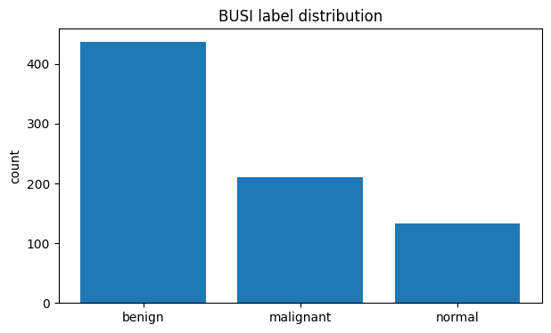
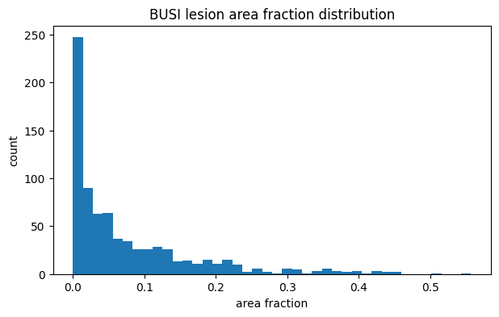
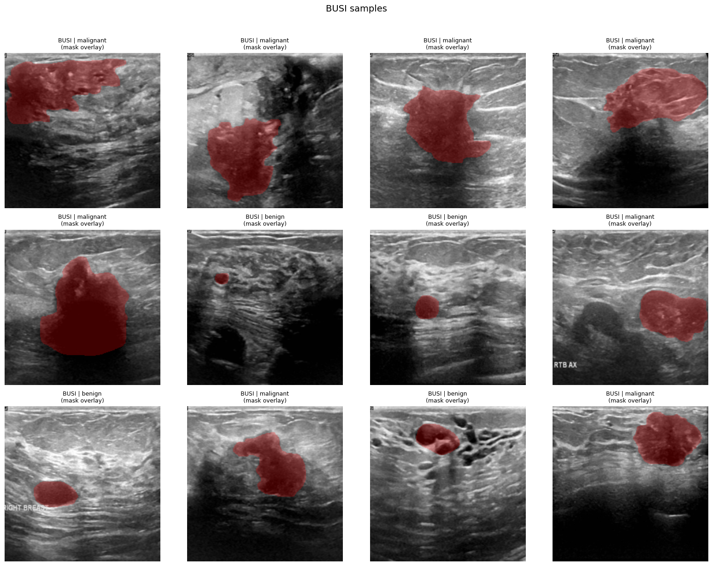
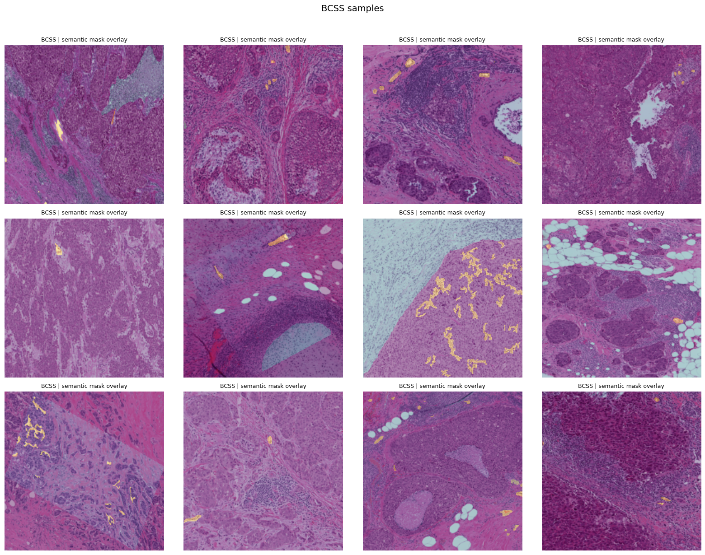
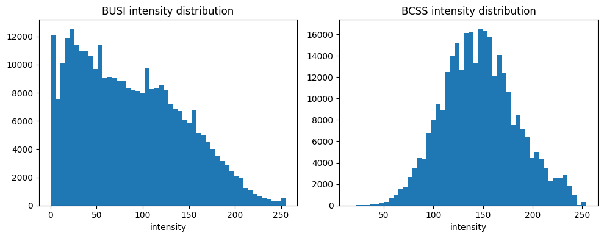
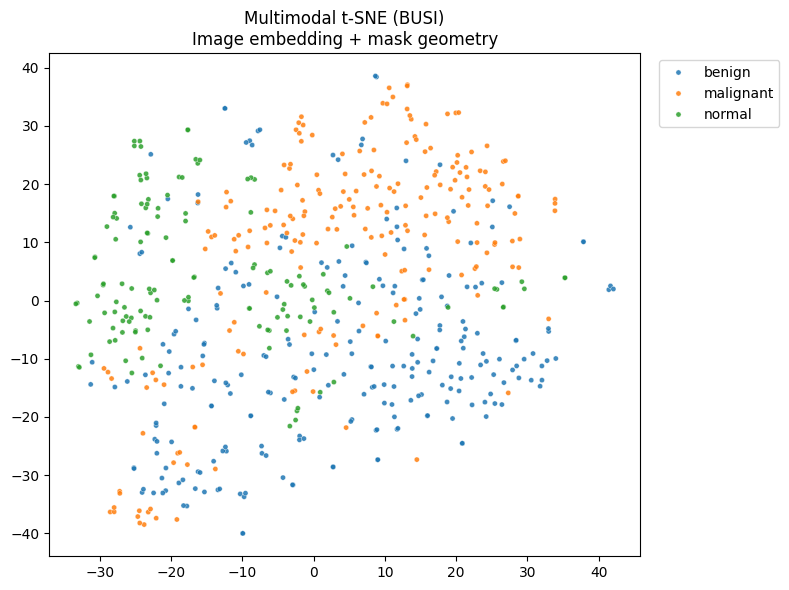

# Homework 1 - Datasets

**Notebook:** [Google Colab](ADD_YOUR_COLAB_LINK_HERE)
**Data:** [Google Drive](https://drive.google.com/drive/folders/1a3FV1p9EALz_J_TzwrJCDlShxR_tSqbg?usp=drive_link)

## Overview

The goal for HW1 was to curate a multimodal dataset to use for the rest of the course. The bigger vision is building an AI "specialized oncologist" — not something that just spits out a label, but one that mirrors how a human clinician reasons: synthesizing 1D (genetics/EEG), 2D (X-rays/pathology), and 3D (MRI/CT) data to diagnose lung, breast, brain, and colon cancers, and being explainable enough to show its work (e.g. localizing a malignant lesion using segmentation masks and linking it to a molecular profile).

The ideal dataset for this is CLIMB, which aggregates multi-institution clinical data across many modalities — but due to time constraints, I narrowed the scope to breast cancer and worked with **BUSI** (breast ultrasound images with lesion segmentation masks) and **BCSS** (breast histopathology patches). BUSI is notoriously noisy and class-imbalanced; BCSS lacks patient-level labels and has staining variability. Crucially, the two aren't patient-aligned, so multimodal learning happens within each dataset rather than across the same patient.

## Building the Dataset

Getting the data was the first hurdle. CLIMB's extraction code on GitHub didn't work, some datasets required institutional agreements I couldn't access, and others were 20GB+. The workaround was manually uploading zip files to Google Drive and mounting Drive in Colab — which ended up being a reliable pattern for the rest of the course.

The preprocessing pipeline resizes all images and masks to 224×224, handles corrupted or missing mask files, and extracts three modalities per sample: ResNet-50 image embeddings, binary/semantic segmentation masks, and mask-derived morphological features (area fraction, compactness, bounding box geometry, centroid). The result is a unified metadata CSV across 606 samples.

## What the Data Looks Like

One of the most striking findings from visualization was just how different BUSI and BCSS are at the pixel level. Ultrasound images are skewed toward low intensities from acoustic shadowing and speckle noise; histopathology images have a much more symmetric distribution from consistent staining. This highlights why normalization matters when fusing across modalities. The BUSI class distribution is also heavily imbalanced (benign: 437, malignant: 210, normal: 133), and lesion sizes vary a lot — most are small relative to the image, but there's a long tail of larger tumors. The t-SNE of fused embeddings shows partial clustering by class, suggesting the combination of visual and structural features captures some discriminative signal, even without a trained classifier.

## Metrics and Prompts

For a clinical classification task, the choice of metrics is guided by the cost of a mistake. Sensitivity is prioritized so malignant cases aren't missed; specificity prevents unnecessary biopsies; F1 and AUPRC handle the class imbalance; AUROC gives the full picture across thresholds. AUPRC is especially important here since positive cases (malignant) are relatively rare.

The prompt engineering section was about designing structured outputs — three scenarios requiring exactly one word from a fixed list, a single label, or a Python dictionary with specific keys. The exercise forced thinking about how to constrain a model's output format to make it actually usable downstream.

## Reflection

The biggest challenge was a major conceptual pivot early on — I originally wanted to build an agentic wet-lab system, but couldn't find a single dataset with the right modality coverage. Switching to CLIMB (and then narrowing further to BUSI/BCSS) was the right move. The most interesting part was learning to extract structure from segmentation masks — projecting them onto the ultrasound and pathology images and seeing what they actually encode was a highlight.

## Results and Visualizations

### Dataset Overview

*BUSI is heavily imbalanced — nearly half the samples are benign, motivating metrics like F1 and AUPRC over raw accuracy.*

*Most lesions occupy a small fraction of the image, with high variance — lesion size alone isn't a reliable discriminator.*

### Sample Visualizations

*BUSI ultrasound samples with lesion masks overlaid in red. Masks localize the tumor and add structural information that complements raw pixel intensity.*

*BCSS histopathology patches with semantic segmentation masks highlighting different tissue regions.*

### Cross-Modal Analysis

*BUSI (left) and BCSS (right) have very different intensity profiles — acoustic shadowing vs. consistent staining. This domain gap makes cross-dataset fusion non-trivial and motivates normalization.*

*t-SNE of fused ResNet-50 image embeddings + mask morphological features, colored by class. Partial clustering suggests the multimodal features carry useful signal, though class overlap remains.*
