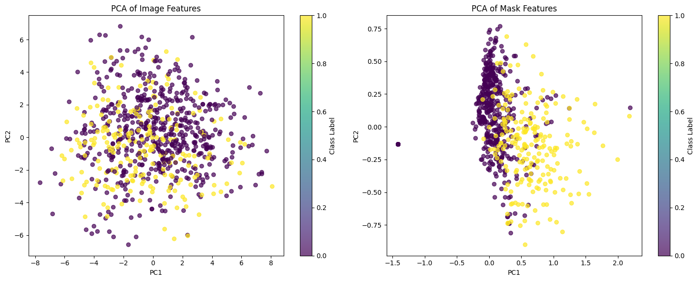
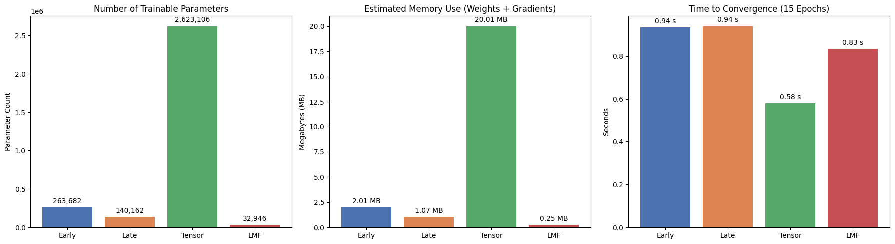
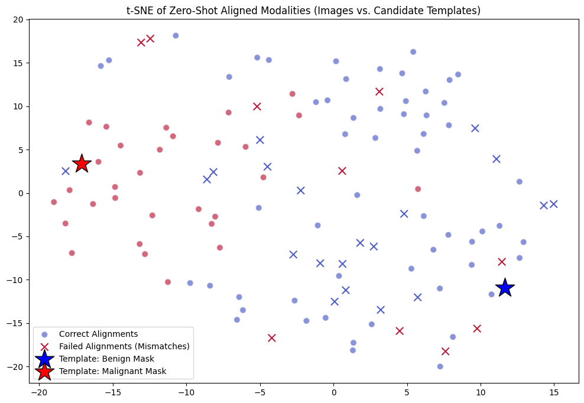
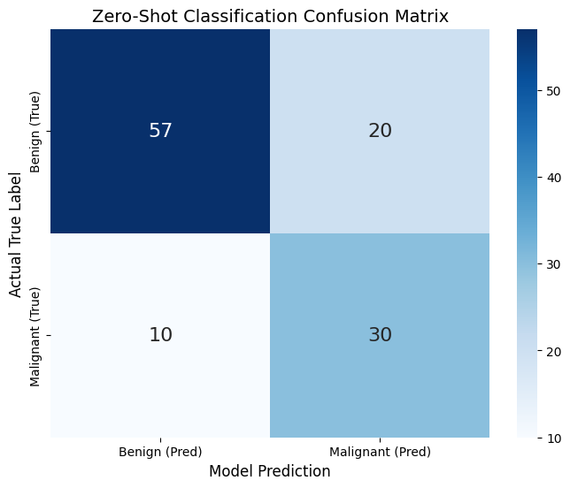

# Homework 2 - Multimodal Fusion

**Notebook:** [Google Colab](ADD_YOUR_COLAB_LINK_HERE)
**Data:** [Google Drive](https://drive.google.com/drive/folders/1a3FV1p9EALz_J_TzwrJCDlShxR_tSqbg?usp=drive_link)

## Overview

HW2 was about actually fusing modalities. The reading covered two papers — *Align Before Fuse* and the *Platonic Representation Hypothesis* — and the coding half involved implementing four fusion methods from scratch on the BUSI dataset from HW1.

## Reading: When and How to Fuse

The *Align Before Fuse* paper argued that representations should be made compatible before merging them. For my dataset, that means within-sample alignment (image ↔ its own mask) rather than across-dataset alignment between BUSI and BCSS, since those aren't patient-paired. I'd start with light fusion — late or gated — and only move to cross-attention if I can show it actually helps. The main risks are that alignment might accidentally erase modality-specific info (like ultrasound texture), or that noisy labels make the model align to scanner artifacts rather than real disease signal.

The *Platonic Representation Hypothesis* suggests that scaling should push modalities toward a shared representation — appealing for a unified oncologist model. But I don't think that emergence would happen automatically here, because supervision only exists within each dataset, and models can find dataset-specific shortcuts (stain effects, scanner patterns) rather than learning genuinely clinical features. Counter-evidence: different modalities carry genuinely different information, so full convergence may not even be the right goal.

## Fusion Implementations

The coding half started with tensor operations and einsum notation, then moved to unimodal baselines on AV-MNIST before implementing fusion on BUSI.

**Unimodal baselines:** The image model hit 64.56% accuracy; the audio model only 41.56%. That ~23% gap reflects how much harder it is for a shallow CNN to pull discriminative features from spectrograms vs. spatial image patterns. Bridging it would require deeper architectures (VGGish, ResNet-18), spectrogram augmentation (SpecAugment), and temporal modeling like LSTMs or Audio Spectrogram Transformers — treating audio as a static 2D image misses its sequential nature entirely.

**Fusion on BUSI (image embeddings + mask geometry features):**

| Method | Val Accuracy |
|---|---|
| Late Fusion | 91.45% |
| Tensor Fusion | 90.60% |
| Early Fusion | 88.89% |
| LMF | 84.62% |

Late Fusion won because the two modalities are so structurally different — dense 2048-dim image embeddings vs. sparse 9-dim geometric features. Letting each subnetwork process its own feature space independently before merging them made more sense than trying to interact them upfront. Tensor Fusion creates a massive parameter footprint from the outer product (2.6M params, 20MB), and on a small dataset like BUSI that just led to overfitting. LMF gets the expressiveness at a fraction of the cost (33K params, 0.25MB), but still underperformed the simpler late fusion setup.

## Contrastive Learning

The second half applied contrastive learning — training a model to align image embeddings and mask geometry features in a shared latent space, then running zero-shot classification. Benign cases aligned better because benign tumors have consistent, smooth shapes — averaging their mask geometries creates a realistic template. Malignant tumors have highly irregular margins, so averaging their geometry across all samples produced a noisy, generic shape that doesn't resemble real malignant tumors. The confusion matrix reflects this: the model defaulted heavily to the benign class.

## Reflection

The most interesting part was seeing contrastive learning break down in practice — trying to align dense pixel texture with flat 9-dimensional geometric features exposed how much the method depends on both modalities being expressive enough to form meaningful templates. Late Fusion ended up being the most practically useful concept: in medical settings where data is scarce and interpretability matters, keeping modalities separate until the final decision is both more robust and more auditable.

## Results and Visualizations

### Feature Space Analysis

*PCA of image features (left) and mask features (right). Images show clearer class separation; mask features overlap more — they're complementary rather than redundant.*

### Fusion Method Comparison

*Parameter count, memory, and convergence time across all four methods. Tensor Fusion is by far the heaviest; LMF is the most efficient. On a small dataset, the added complexity didn't translate to better accuracy.*

### Zero-Shot Alignment

*t-SNE of image embeddings vs. mask geometry templates after contrastive alignment. There's a general separation between classes, but heavy overlap in the middle — real-world ultrasound features rarely match textbook examples.*

*Zero-shot confusion matrix. The model correctly identifies most benign cases but misses nearly a third of malignant ones, showing a strong bias toward the most abundant class.*
