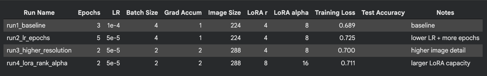
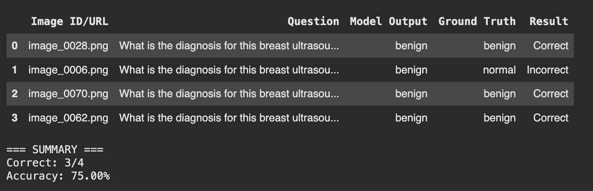
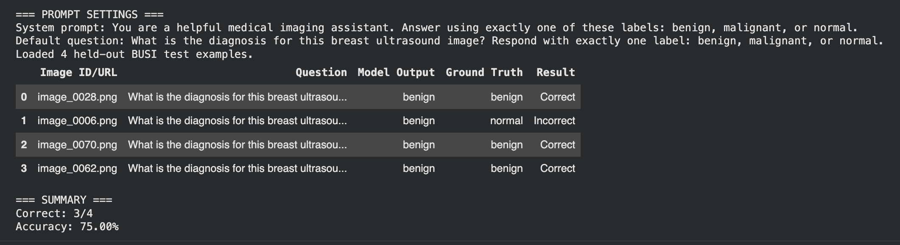

# Homework 3 - Vision-Language Models

**Notebook:** [Google Colab](ADD_YOUR_COLAB_LINK_HERE)
**Data:** [Google Drive](https://drive.google.com/drive/folders/1a3FV1p9EALz_J_TzwrJCDlShxR_tSqbg?usp=drive_link)

## Overview

HW3 was about Vision-Language Models — reading about how they work, then actually fine-tuning one. The model was **Qwen2.5-VL-3B-Instruct**, fine-tuned on the BUSI breast ultrasound dataset from HW1 for lesion classification (benign / malignant / normal).

## Reading: Data Quality, Frozen LLMs, and Bigger Questions

The reading covered three papers plus discussions on Sora and AGI. A few threads stood out:

On **data quality**: weak alignment between modalities — like a dog image paired with "click here" — hurts performance because models learn inconsistent cross-modal relationships instead of meaningful ones. The *Quality Not Quantity* paper shows that mixing a noisy dataset with a clean one doesn't help; the noisy source just dilutes the cleaner generalization. Low CLIP-similarity between an image and its text is a practical signal that a pair is noisy. With unlimited resources, the right approach is to evaluate each source separately, filter by cross-modal alignment scores, and select subsets that are both clean and complementary.

On **frozen LLMs**: the intuition is that LLMs already have few-shot learning, world knowledge, and rapid task adaptation from pretraining — so instead of retraining everything on a small image-text dataset (which would dilute those capabilities), you learn to convert other modalities into a form the LLM can already process. A vision encoder like NF-ResNet-50 maps image inputs to the same dimensionality as text token embeddings, and the frozen Transformer attends across both using self-attention — it's modality-agnostic at the architecture level.

On **Sora and AGI**: mostly agree with LeCun's point that generating realistic video isn't the same as understanding physical rules. These models capture correlations rather than causality. That said, work like Frozen shows grounding can help models connect to the real world, so generative AI feels like an important part of the path to AGI — just not sufficient on its own. Real-world understanding probably also needs grounding, reasoning, memory, and environmental interaction.

## Fine-Tuning on BUSI

The dataset was prepared as an 80/20 random train/test split. A stratified split or k-fold were considered, but k-fold would be too computationally expensive for VLM fine-tuning on a limited dataset.

**Baseline (no fine-tuning):** With a prompt constrained to output exactly one label, the pre-trained model got 3/4 held-out images correct (75%). The failure mode was overpredicting benign — including misclassifying one normal image — which tracks with benign being the most abundant class. The mistakes correlated with category confusion between normal and benign, not with the phrasing of the question.

**Prompt engineering:** None of the prompt variations — adding few-shot examples, more cautious wording, explicit formatting instructions — improved performance. Everything stayed at 75%. This suggested the bottleneck wasn't prompt clarity but the model's ability to distinguish subtle visual differences in ultrasound images, especially normal vs. benign.

**LoRA fine-tuning:** Four runs were tested across learning rate, epochs, image resolution, and LoRA rank/alpha:

| Run | Key Settings | Train Loss | Test Acc |
|---|---|---|---|
| run1_baseline | 3 epochs, lr=1e-4, 224px, r=4 | 0.689 | — |
| run2_lr_epochs | 5 epochs, lr=5e-5, 224px, r=4 | — | 0.725 |
| run3_higher_resolution | 2 epochs, lr=5e-5, 288px, r=4 | — | 0.700 |
| run4_lora_rank_alpha | 2 epochs, lr=5e-5, 288px, r=8 | — | 0.711 |

The simplest baseline had the lowest training loss; the lower-LR longer run had the best test accuracy. Increasing image resolution or LoRA capacity didn't help — with a small dataset, simpler setups generalized better, and larger-capacity adapters tended to overfit or destabilize optimization.

**Post fine-tuning:** The fine-tuned model stayed at 75% on the same held-out images, and the same error persisted — the normal image was still predicted as benign. LoRA fine-tuning mainly preserved the baseline behavior rather than improving it.

## Reflection

The most interesting — and honestly frustrating — takeaway was that fine-tuning didn't help. Before this homework, I expected that with reasonable hyperparameters, fine-tuning should usually improve things. But with limited data and subtle visual distinctions, improvement isn't guaranteed. The model kept making the same mistake even after adaptation. For the goal of building AI tools for medical imaging, this feels really important to internalize: a model that sounds plausible but keeps making the same classification error isn't useful, no matter how cleanly it formats its output.

## Results and Visualizations

### Hyperparameter Sweep

*Four LoRA runs varying LR, epochs, image resolution, and rank. The simplest baseline achieved the lowest training loss; the lower-LR longer run had the best test accuracy. More capacity didn't help on a small dataset.*

### Baseline Inference

*Pre-trained model on 4 held-out BUSI images: 3/4 correct (75%), but predicted benign for all four — the normal image was misclassified.*

### Fine-tuned Model Inference

*Fine-tuned model on the same images: still 75%, same error. Fine-tuning preserved baseline behavior rather than changing the model's decision boundary.*
